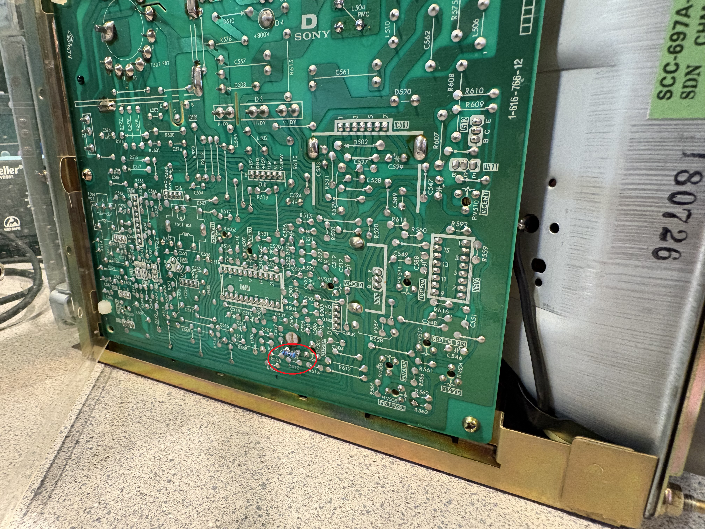
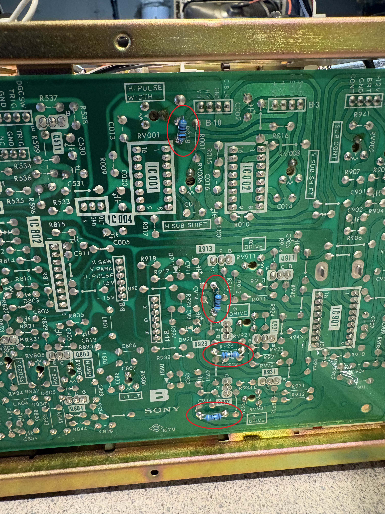
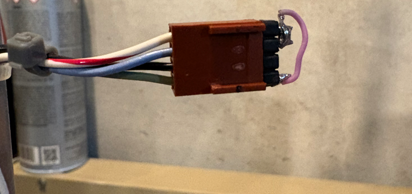
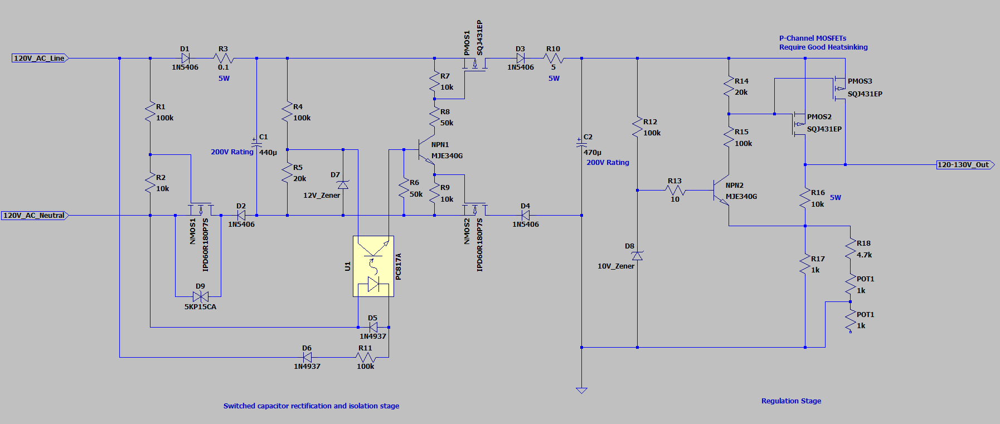
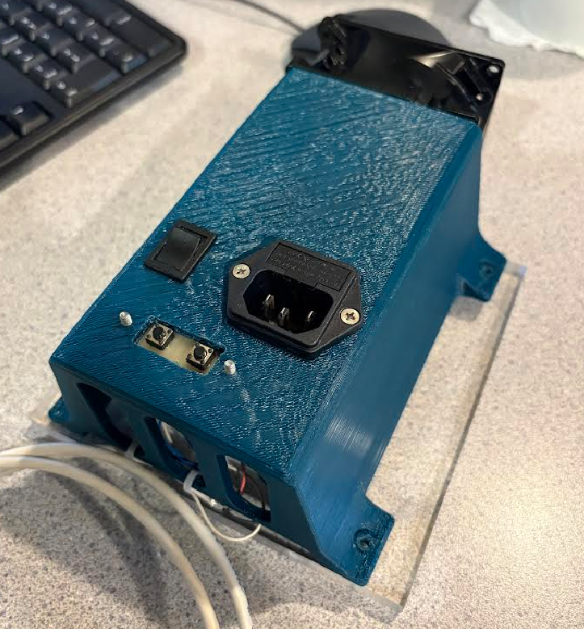
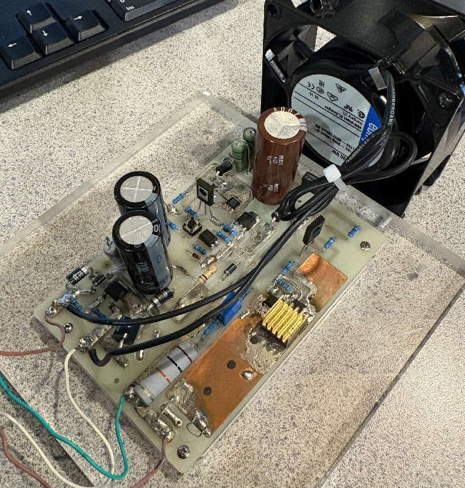

# CHM_9001_00_Frequency_Conversion
  
The CHM_9001_00 Trinitron monitor was originally designed for 25kHz horizontal scanline frequency, required for the video on the original HP logic analyzer unit that it was associated with. This makes it difficult to use with a standard VGA source. But with some relatively simple mods, it can be made to work at 31.5kHz for standard 640x480 VGA resolution and 60Hz refresh.  

## Modifications to CHM-9001-00 CRT boards for operation at 31.5kHz
* 20kOhm resistor in parallel with R504 on Board D in order to bias the horizontal oscillator circuit. Some adjustment of pot RV501 will likely be necessary to get it to sync to 31.5kHz.  

* 400kOhm resistor in parallel with R018 on Board B in order to sufficiently decrease the duration of the "HD" pulse to fit within a 31.5kHz period. Again, adjustment of the associated pot RV001 is still necessary to get the horizontal raster to look correct.  

* Optionally, add 47 Ohm resistors across R915, R926, and R935 of Board B. These resistors appear to be for scaling the current sources used on the RGB signals that are sent to the neck board (it appears to use current waveforms instead of voltage, probably to reduce the effects of interference on the associated cable). I found that I needed to add these resistors to boost the current a bit to increase the contrast. I suspect that the increase in horizontal frequency results in a small decrease in some of the flyback-generated supplies, including the one used for the cathode amplifiers. So boosting the RGB signal a bit helps to compensate.  
* Brightness (blue) and contrast (green) inputs jumpered directly to the 12V (white/red stripe) pin on the "B2" connector/cable, in which case the "Sub Brightness" and "Sub Contrast" pots on Board B can be used to make manual adjustments.  

  

## Custom 120V-130V Power Supply
  
After evaluating a few options for powering the CHM-9001-00, which requires a nominal B+ of 120V, I decided to design my own power supply. This was an ambitious project, and it's something I might try to continually improve over time, but the end product does work (with a few caveats). This design uses a "flying capacitor" architecture to alternately charge 440 microfarads of capacitance across 120V AC line voltage and then dump the charge into a storage capacitor on the "secondary" DC side. This allows it to generate the relatively large output voltage while providing DC isolation. Critically, the negative side of the DC output can be tied to ground of the CHM-9001-00 (which is effectively chassis ground) without any AC current flow to ground. As with anything that's an immature design, there's always the possibilty for failure, which is why I highly recommend running a supply like this off a GFCI outlet. If anything goes wrong and there's a small AC current leak to ground, the GFCI will kill power and prevent damage. That said, I've used this supply for many, many hours with my CHM-9001-00 without problem. There are a few things to be aware of, listed below:  
* This is designed for 120V AC, 60Hz, such as you would find in US homes. I'm sure it can be modified for other voltages and frequencies with enough design work, but I haven't looked into that at all. 
* Always use with a GFCI outlet, like I mentioned above. 
* Please see the schematic below for design details and the specified parts. This is intended as a sort of hybrid SMD/through-hole design, which I've implemented on a double-sided milled PCB. I won't go into a lot of fabrication details here, because there are various ways this could be implemented. Just be sure to use equivalent or higher-rated parts if you use a different PCBA technology or assembly method. 
* Some of the resistors require parts rated for at least 5W, which is indicated on the schematic. Other resistors can be 1/4W or larger. 
* You might find that simply unplugging or plugging in the unit can cause a GFCI to trip. This can be resolved if you install a properly rated AC switch on the "line" side of the AC input, and turn it to "off" any time you plug/unplug the unit. This ensures that the "neutral" maintains a connection to the AC before all connections are made or broken. 
* Heatsinking of the two regulation p-channel MOSFETs in the DC section is quite necessary, as they burn a lot of power. The CHM-9001-00 will draw about 400mA. The regulation MOSFETs have to handle that current, with a voltage drop of up to ~25V, producing about 10W of waste heat. I've put a small, machined brass heatsink on a large copper pad that drains are connected to. Additionally, having some forced airflow with a small fan is also a good idea, especially if the unit is enclosed. 
* The nominal B+ voltage requirement for the CHM-9001-00 is 120V DC, but with the frequency conversion to 31.5kHz that I detailed above, the horizontal raster will be reduced at this voltage. I've successfully run the CHM-9001-00 at around 130V by trimming my supply up (adjustable by way of "POT1" in the DC section) without any issue. This doesn't quite make raster the full width of the CRT, but it's close. I don't know how far the B+ can be safely pushed up. You can try at your own risk. The design of this supply will max out around 145V. 
* DC input for the B+ on the CHM-9001-00 is at the "B4" connector (red and white stripe for +120V, black for ground, blue for degauss). Be careful to make the proper connections. Gegauss can be activated by momentarily connecting the degauss pin to ground (NOT 120V!). 
* Always be careful around 120V DC. Even though this is an isolated voltage, it's still large! It's also not as physically apparent when you accidentally touch a large DC voltage, as with AC.  
 

 

 

 
Tom Verbeure's excellent GitHub repository on the CHM-9001-00 has lots of additional information about this Trinitron monitor, available [here](https://tomverbeure.github.io/2022/10/05/Sony-CHM-9001-00-CRT.html).  
